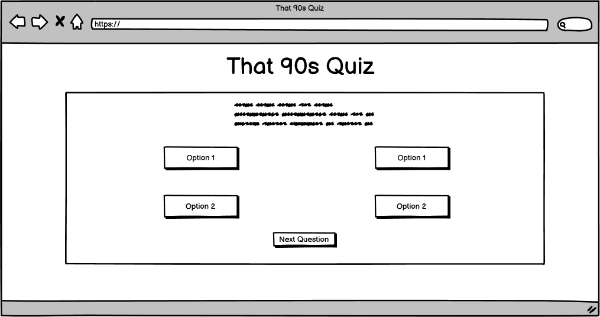

# That 90s Quiz

## Contents

* [User Experience](#user-experience-ux)
  * [User Stories](#user-stories)

* [Design](#design)
  * [Typography](#typography)
  * [Imagery](#imagery)
  * [Wireframes](#wireframes)
  * [Final Design](#design)

* [Features](#features)
  * [Future Implementations](#future-implementations)

* [Accessibility](#accessibility)

* [Technologies Used](#technologies-used)

* [Deployment & Local Deployment](#deployment--local-development)

* [Testing](#testing)

* [Credits](#credits)

## User Experience (UX) 

### Initial Discussion

Users can test their knowledge of the 90's across many genres.

### User Stories

#### First Time Visitor Goals

- I want to easily access the rules of the quiz.
- I want to be able to start the quiz with ease.
- I want to be able to view both the current score and a timer.
#### Returning Visitor Goals

- I would like to be able to view my previous score.

#### Frequent Visitor Goals

- I would like to be able to access and play the quiz across many devices with no performance or readability issues. 

## Design

### Typography

### Imagery

### That 90's Quiz Color Scheme 

### Wireframes

#### Start Quiz Screen

#### Questions Page

## Final Design

### Quiz

#### Desktop Version

#### Mobile Version

### Features

### Future Implementations
 
   
## Accessibility

## Technologies Used

- #### [Visual Studio Code](https://code.visualstudio.com/)
The entirety of the site was coded using Visual Studio Code.

- #### [Balsamiq](https://balsamiq.com/wireframes/?gclid=Cj0KCQiA14WdBhD8ARIsANao07g6CkndNmxQPlHP92mM3VQBwb6lbQIg5FPinhmNFxWsAnM7BpA_PukaAldMEALw_wcB)
  Balsamiq was used to help create the initial design for the websites layout.

### Languages Used

- The main structure of the website was created using HTML.
- The styling of the website was created with CSS.
- The structure and workings of the quiz itself was created using Javascript.

## Deployment & Local Development

### Deployment

This website was created using Visual Studio Code and pushed to GitHub under the repository name 'that-90s-quiz'.

GitHub pages was then used to deploy the live version of the site, the following instructions for this can be found below:

1. Log in to GitHub account (or sign up if there is no account)
2. Locate the repository for the project, 'that-90s-quiz'
3. Access the settings page.
4. In the navigation bar on the left-hand side choose the link for Pages.
5. When choosing a source, choose the main branch from the drop down menu, and select root from the folder name. 
6. Finally click Save, the live GitHub page for your site will then been deployed.

### Local Development
#### How to Fork

In order to fork the repository the following must be done:

1. Log into your GitHub account or create one. 
2. Locate the repository for this project under, ZoeMacf/that-90s-quiz/
3. Finally, click the fork button in the top right corner.

#### How to Clone

In order to clone the repository for local development you will need to follow the below:

1. Log into your GitHub account. 
2. Go to the repository for this project at ZoeMacf/that-90s-quiz/
3. Next you will need to click on the green '<> Code' button and then choose your preferred method.
4. Access the terminal in your code editor, create a new directory that you would like to use for the clone. 
5. Then type 'git clone' into your code editor's terminal, paste the link from step 3 and hit enter. 
## Testing

### Further Testing

### Bugs Found

## Credits

### Acknowledgements