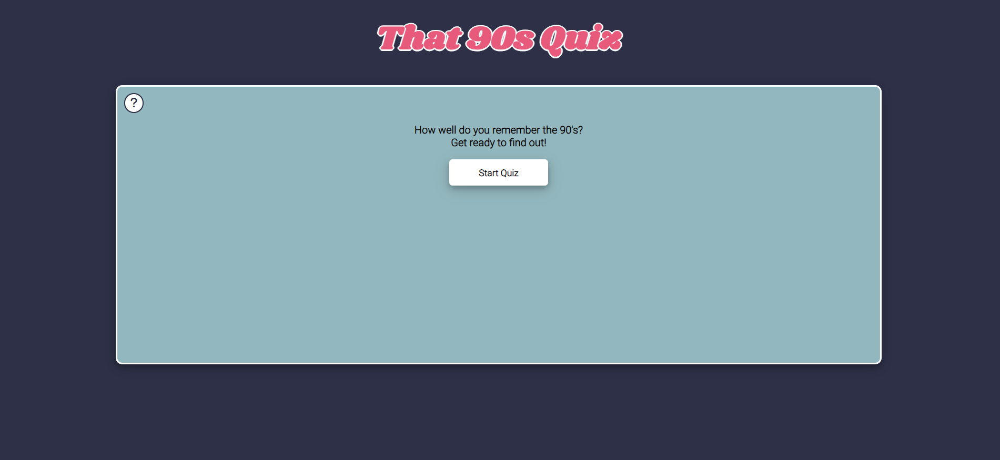

# That 90's Quiz

That 90's Quiz is a quiz to test the user's 90's trivia, they will be able to see their score at the end and restart to try and score even higher. 

The live site can be viewed here [The 90's Quiz](https://zoemacf.github.io/that-90s-quiz/) .

## Contents

* [User Experience](#user-experience-ux)
  * [User Stories](#user-stories)

* [Design](#design)
  * [Typography](#typography)
  * [Imagery](#imagery)
  * [Wireframes](#wireframes)
  * [Final Design](#design)

* [Features](#features)
  * [Future Implementations](#future-implementations)

* [Accessibility](#accessibility)

* [Technologies Used](#technologies-used)

* [Deployment & Local Deployment](#deployment--local-development)

* [Testing](#testing)

* [Credits](#credits)

## User Experience (UX) 

### Initial Discussion

Users can test their knowledge of the 90's across many genres.

### User Stories

#### First Time Visitor Goals

- I want to easily access the rules of the quiz.
- I want to be able to start the quiz with ease.
- I want to be able to view both the current score and a timer.
#### Returning Visitor Goals

- I would like to be able to see the correct answer if I choose wrong.

#### Frequent Visitor Goals

- I would like to be able to access and play the quiz across many devices with no performance or readability issues. 

## Design

This site has gone through three designs initially a simple blue themed design which was changed out for a black and pink neon approach however due to low contrast scores this was changed a final time to a theme similar to a Nintendo GameBoy to stick with the 90's theme. Images of all three designs will be included below. 

### Typography

For the main heading of this quiz the font family 'Oswald' was chosen, this font is quite similar to the font that was used on a GameBoy and as well as this, the simplistic look to it helped bring the elements together.

For the remainder of the site, the font family 'Press Start 2P' was chosen to help give the quiz the retro pixelated look of a classic GameBoy.

### That 90's Quiz Color Scheme 

The colour scheme chosen uses the various green tones found on the original GameBoy screen, along with the grey to represent the device itself.

### Wireframes

#### Start Quiz Screen

#### Questions Screen

## Original Design

#### Start Screen

#### Questions Screen

#### Final Score Screen

## Neon Design

#### Start Screen

#### Questions Screen

#### Final Score Screen

## GameBoy Design
#### Start Screen

#### Questions Screen

#### Final Score Screen

#### Mobile View

### Features

#### Rules

The rules for the quiz can be accessed through a rules button located in top left of the game's container div. 

#### Timer

A timer was added to the quiz to give the user a time limit to answer the questions. If an answer is not choesen within this timeframe the buttons become disabled and the user has to skip the question.

### Future Implementations

In future I would like to have the questions and answers to shuffle on each restart. I would also like to allow the user to save their score and be able to access a high score section of the quiz. 

Allow the user to share their high score on various social media accounts. 
## Accessibility

To ensure that this quiz was accessible to all users the following was done:

* Ensure that non-contrasting colours were used in the final design, this was initially not the case with one of the designs and thus a redesign was needed.
* An aria-label was added to the rules button.

And finally WAVE (Web accessibility evaluation tool) was used to ensure that the site was accessible to all users and followed semantic standards. 

## Technologies Used

- #### [Visual Studio Code](https://code.visualstudio.com/)
The entirety of the site was coded using Visual Studio Code.

- #### [Balsamiq](https://balsamiq.com/wireframes/?gclid=Cj0KCQiA14WdBhD8ARIsANao07g6CkndNmxQPlHP92mM3VQBwb6lbQIg5FPinhmNFxWsAnM7BpA_PukaAldMEALw_wcB)
Balsamiq was used to help create the initial design for the websites layout.

- #### [Google fonts](https://fonts.google.com/knowledge)
Google Fonts was used to source both 'Oswald' and 'Press Start 2P' font families.

### Languages Used

- The main structure of the website was created using HTML.
- The styling of the website was created with CSS.
- The structure and workings of the quiz itself was created using Javascript.

## Deployment & Local Development

### Deployment

This website was created using Visual Studio Code and pushed to GitHub under the repository name 'that-90s-quiz'.

GitHub pages was then used to deploy the live version of the site, the following instructions for this can be found below:

1. Log in to GitHub account (or sign up if there is no account)
2. Locate the repository for the project, 'that-90s-quiz'
3. Access the settings page.
4. In the navigation bar on the left-hand side choose the link for Pages.
5. When choosing a source, choose the main branch from the drop down menu, and select root from the folder name. 
6. Finally click Save, the live GitHub page for your site will then been deployed.

### Local Development
#### How to Fork

In order to fork the repository the following must be done:

1. Log into your GitHub account or create one. 
2. Locate the repository for this project under, ZoeMacf/that-90s-quiz/
3. Finally, click the fork button in the top right corner.

#### How to Clone

In order to clone the repository for local development you will need to follow the below:

1. Log into your GitHub account. 
2. Go to the repository for this project at ZoeMacf/that-90s-quiz/
3. Next you will need to click on the green '<> Code' button and then choose your preferred method.
4. Access the terminal in your code editor, create a new directory that you would like to use for the clone. 
5. Then type 'git clone' into your code editor's terminal, paste the link from step 3 and hit enter. 
## Testing

### W3C Validator

[W3C](https://validator.w3.org/nu/) was used in order to test the HTML for both the index page and 404 error page. 

The HTML validation process used on this website passed. 

### Jigsaw CSS Validator

In order to ensure that the CSS used throughout this site was correctly written, [Jigsaw](https://jigsaw.w3.org/css-validator/) was used as a validation tool. 

The CSS validation process used on this website passed. 

### Lighthouse 

Chrome's lighthouse developer tool was used to check the performance of the quiz after the moving of the Font Awesome script and fixing the contrasting colours of the previous design the site passed perfectly.

### Further Testing

In order to fully test the functionality of the site, manual testing was done on the following devices.

- Laptop Used : HP EliteBook 8570w
- Mobile : Samsung S21 Plus

The following browsers were used across the above devices

* Google Chrome
* Firefox
* Safari (Emulated through Browserstacks)

There were no major issues across Google Chrome, Firefox or Safari, however on Safari and Firefox there were some slight css issues regarding the text in the answer buttons. 

| Feature Tested  | Outcome  | Test Performed  | Result  | Pass/Fail  |
|---|---|---|---|---|
| `Start Screen`  |   |   |   |   |
| Rules Modal  |  The modal should display and when the button is clicked and be readable for the user | Click on the '?' button on start screen | A modal with the rules for the game appears  | Pass  |
|  Start Quiz | Should display the first question with populated answer buttons and begin the timer. | Click on the 'Start Quiz' button.  |  Displays first question with answers to choose from, timer starts to count down from 10. | Pass |
|  `Questions Screen` |   |   |   |   |
|  Timer | Timer should countdown to 0 with no issues and disable buttons if an answer has not been clicked on.  |  Wait for timer to reach '0' | Answer buttons become disabled. | Pass |
| Correct Answer  | When the correct answer is chosen, the button should turn green and the remaining buttons become disabled.  | Click on the correct answer.  |  Correct answer is coloured green | Pass  |
|  Wrong Answer | When the correct answer is chosen, the button should turn red and the remaining buttons become disabled.  | Click on the wrong answer. | Wrong answer is coloured red  | Pass  |
|  Next Question Button | When clicked should display the next question and reset the timer  | Click the next question button  | Next question on the quiz is displayed and timer resets to '10'  | Pass 
| `Results Screen`   |   |   |   |   |
|  User's Score | As answers are selected throughout the quiz the program should check the answers, add the score and finally display to the user.  | Run through quiz selecting a combination of correct and wrong answers to ensure program factors in both.  | Correct score based on the answers chosen is displayed at the end.  | Pass  |
|  Restart Quiz button| Reset all values and bring the user back to the start screen for the quiz.  | Click on next question button  |  Directed back to the start screen | Pass  |

### Bugs Found

The following bugs were found throughout the development and general use of the site. 

#### Bug 1

When using the quiz the timer would countdown from the initial value of 15 but would stop when it reached 1 and disable the buttons. 

In order to fix this, I declared the timer value outside of the countdown function, gave it a value within the function. 

As well as this, setting the timer innerHTML to timer was causing a delay in displaying the time which factored in to the timer stopping at 1. This was fixed by setting the innterHTML before the countdown and inside it. 

#### Bug 2

The paragraph elements used to hold the questions was pushing down the answer and next question buttons whenever there was a particularly long question. 

This was fixed by setting a padding of 0 to the p element. 

#### Bug 3

If the user clicks outside of the buttons but within the answer container the entire div is coloured red as the code is listening for the users targeted event and checks if it is equal to the current value. As there is none the whole div becomes red.

Unfortunately I have been unable to fix this issue, but believe that by changing how the checkAnswer function works this would be possible. 

## Credits

### Acknowledgements