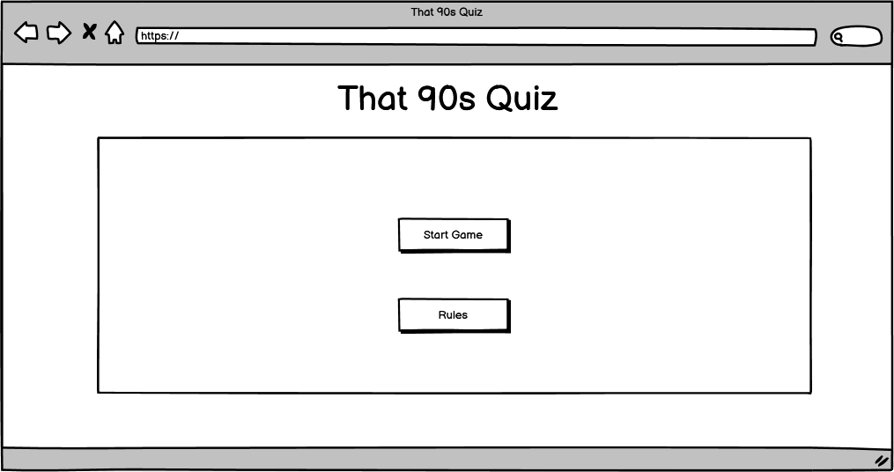
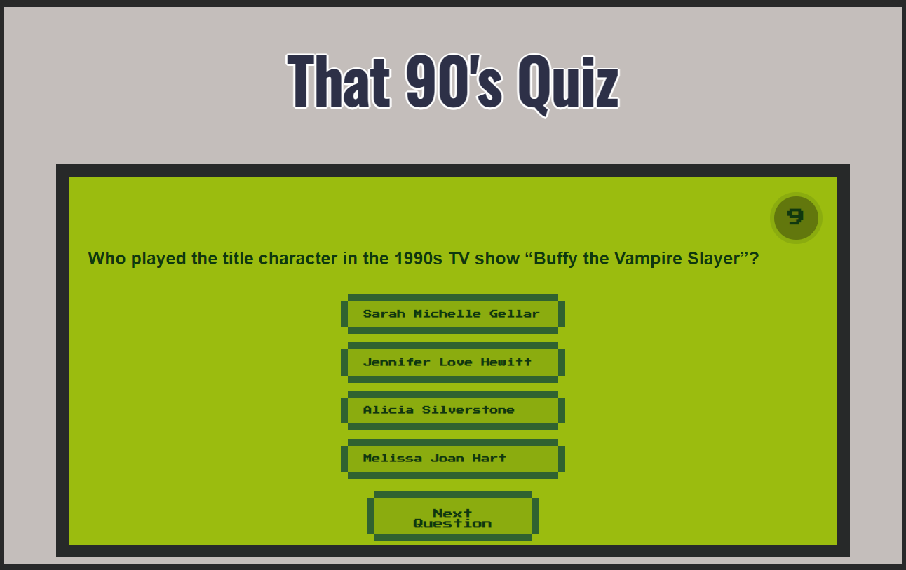

# That 90's Quiz

That 90's Quiz is a quiz to test the user's 90's trivia, they will be able to see their score at the end and restart to try and score even higher. 

The live site can be viewed here [The 90's Quiz](https://zoemacf.github.io/that-90s-quiz/) .

## Contents

* [User Experience](#user-experience-ux)
  * [User Stories](#user-stories)

* [Design](#design)
  * [Typography](#typography)
  * [Imagery](#imagery)
  * [Wireframes](#wireframes)
  * [Final Design](#design)

* [Features](#features)
  * [Future Implementations](#future-implementations)

* [Accessibility](#accessibility)

* [Technologies Used](#technologies-used)

* [Deployment & Local Deployment](#deployment--local-development)

* [Testing](#testing)

* [Credits](#credits)

## User Experience (UX) 

### Initial Discussion

Users can test their knowledge of the 90's across many genres.

### User Stories

#### First Time Visitor Goals

- I want to easily access the rules of the quiz.
- I want to be able to start the quiz with ease.
- I want to be able to view both the current score and a timer.
#### Returning Visitor Goals

- I would like to be able to see the correct answer if I choose wrong.

#### Frequent Visitor Goals

- I would like to be able to access and play the quiz across many devices with no performance or readability issues. 

## Design

This site has gone through three designs initially a simple blue themed design which was changed out for a black and pink neon approach however due to low contrast scores this was changed a final time to a theme similar to a Nintendo GameBoy to stick with the 90's theme. Images of all three designs will be included below. 

### Typography

For the main heading of this quiz the font family 'Oswald' was chosen, this font is quite similar to the font that was used on a GameBoy and as well as this, the simplistic look to it helped bring the elements together.

For the remainder of the site, the font family 'Press Start 2P' was chosen to help give the quiz the retro pixelated look of a classic GameBoy.

### That 90's Quiz Color Scheme 

The colour scheme chosen uses the various green tones found on the original GameBoy screen, along with the grey to represent the device itself.

### Wireframes

#### Start Quiz Screen

#### Questions Screen

## Original Design

#### Start Screen

#### Questions Screen

#### Final Score Screen

## Neon Design

#### Start Screen

#### Questions Screen

#### Final Score Screen

## GameBoy Design
#### Start Screen

#### Questions Screen

#### Final Score Screen

#### Mobile View

### Features

#### Rules

The rules for the quiz can be accessed through a rules button located in top left of the game's container div. 

#### Timer

A timer was added to the quiz to give the user a time limit to answer the questions. If an answer is not choesen within this timeframe the buttons become disabled and the user has to skip the question.

### Future Implementations

In future I would like to have the questions and answers to shuffle on each restart. I would also like to allow the user to save their score and be able to access a high score section of the quiz. 

Allow the user to share their highscore on various social media accounts. 
## Accessibility

## Technologies Used

- #### [Visual Studio Code](https://code.visualstudio.com/)
The entirety of the site was coded using Visual Studio Code.

- #### [Balsamiq](https://balsamiq.com/wireframes/?gclid=Cj0KCQiA14WdBhD8ARIsANao07g6CkndNmxQPlHP92mM3VQBwb6lbQIg5FPinhmNFxWsAnM7BpA_PukaAldMEALw_wcB)
Balsamiq was used to help create the initial design for the websites layout.

- #### [Google fonts](https://fonts.google.com/knowledge)
Google Fonts was used to source both 'Oswald' and 'Press Start 2P' font families.

### Languages Used

- The main structure of the website was created using HTML.
- The styling of the website was created with CSS.
- The structure and workings of the quiz itself was created using Javascript.

## Deployment & Local Development

### Deployment

This website was created using Visual Studio Code and pushed to GitHub under the repository name 'that-90s-quiz'.

GitHub pages was then used to deploy the live version of the site, the following instructions for this can be found below:

1. Log in to GitHub account (or sign up if there is no account)
2. Locate the repository for the project, 'that-90s-quiz'
3. Access the settings page.
4. In the navigation bar on the left-hand side choose the link for Pages.
5. When choosing a source, choose the main branch from the drop down menu, and select root from the folder name. 
6. Finally click Save, the live GitHub page for your site will then been deployed.

### Local Development
#### How to Fork

In order to fork the repository the following must be done:

1. Log into your GitHub account or create one. 
2. Locate the repository for this project under, ZoeMacf/that-90s-quiz/
3. Finally, click the fork button in the top right corner.

#### How to Clone

In order to clone the repository for local development you will need to follow the below:

1. Log into your GitHub account. 
2. Go to the repository for this project at ZoeMacf/that-90s-quiz/
3. Next you will need to click on the green '<> Code' button and then choose your preferred method.
4. Access the terminal in your code editor, create a new directory that you would like to use for the clone. 
5. Then type 'git clone' into your code editor's terminal, paste the link from step 3 and hit enter. 
## Testing

### Further Testing

### Bugs Found

## Credits

### Acknowledgements